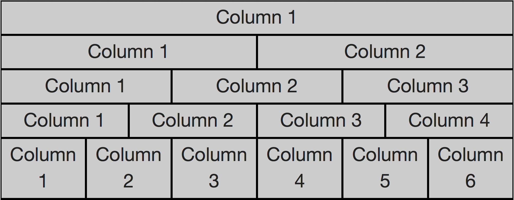
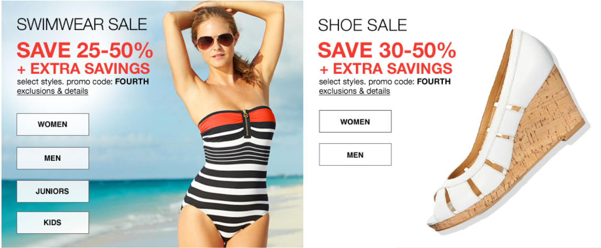

#Responsive grid exercises using Zurb Foundation

##DIRECTIONS

###Excercise 1: 
Build foundation grid with column layout for up to 12 columns. Make sure all columns are full width on mobile. See image below.

###Excercise 2: 
Create a 2x2 layout for large screens and 4 images stacked for mobile. use images labeled 'image_480_ '

###Exercise 3: 
Create the layout below using the images labeled 'nested-images'. Be sure to use nested rows. 

###Excercise 4: 
Create a block grid using the images labed 'block-grid' to render the results below.

###Excercise 5: 
Use the first two images from Excercise 2 to make the right image render above the left on mobile only. Swimsuit image should stay on the left size for medium - large.  

